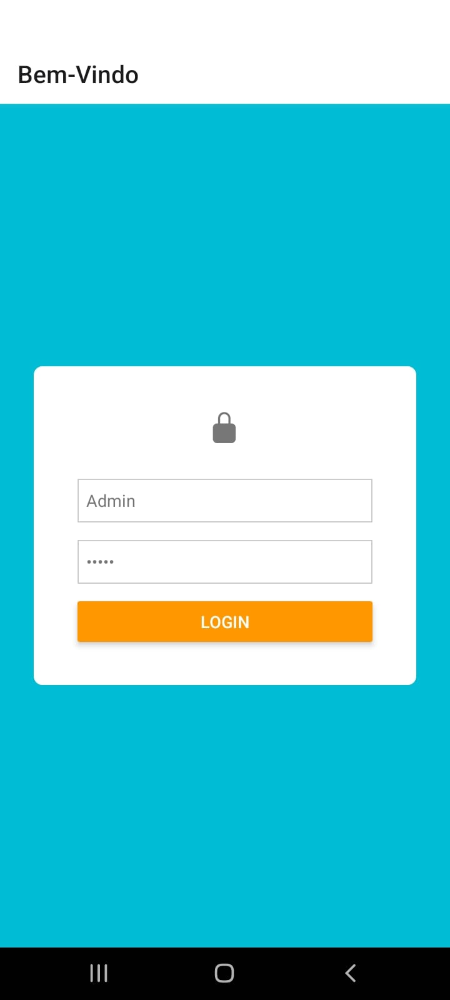
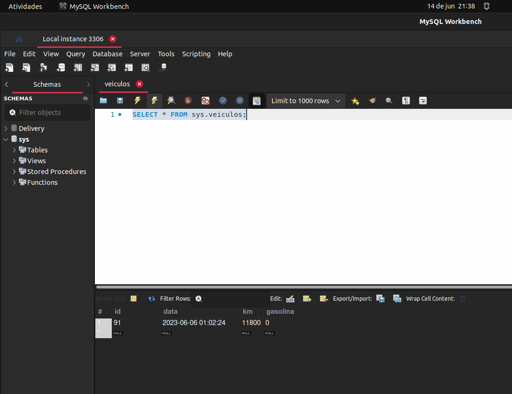

<h3>Tela de Login com Funcionalidade CRUD para Registro de Dados Automotivos</h3>

 

 
 

 
 

 

<strong>Introdução:</strong>
É com grande prazer que apresento a você uma nova tela de login com recursos excepcionais, projetada para ajudá-lo a acompanhar os detalhes importantes do seu veículo. Desenvolvi um sistema que permite o registro de informações relevantes, como quilometragem percorrida, consumo de combustível e datas de eventos, como troca de óleo. Vamos explorar essa incrível ferramenta juntos!

 
 

<strong>Descrição do Sistema:</strong>
A tela de login é o ponto de partida para acessar o sistema de registro de dados automotivos. Ao inserir o ID e a senha corretos, você terá acesso ao painel principal, onde poderá interagir com as funcionalidades disponíveis.

 

<strong>1: CRUD (Create, Read, Update, Delete)</strong>
O sistema oferece um conjunto completo de operações CRUD para a manipulação dos dados registrados. Com essas funcionalidades, você poderá inserir, visualizar, atualizar e excluir informações conforme necessário. Dessa forma, você terá total controle sobre os registros e poderá ajustá-los de acordo com a evolução do seu veículo.

 

<strong>2: Registro de Quilometragem:</strong>
A funcionalidade de registro de quilometragem permite que você insira os dados referentes à quilometragem percorrida pelo seu veículo. Essa informação é essencial para monitorar o desgaste e o intervalo entre as manutenções, além de ajudar a planejar as revisões futuras. Com o sistema, você poderá registrar facilmente as atualizações da quilometragem de maneira organizada e precisa.

 

<strong>3: Registro de Consumo de Combustível:</strong>
Com o objetivo de auxiliá-lo no monitoramento do consumo de combustível, criei uma funcionalidade dedicada ao registro desses dados. Você poderá inserir informações sobre a quantidade de litros abastecidos, permitindo que o sistema calcule e apresente automaticamente o consumo médio do veículo. Isso o ajudará a planejar suas rotas e economizar combustível.

 

<strong>4: Registro de Eventos e Manutenção:</strong>
Nesse sistema, você também poderá registrar datas importantes relacionadas à manutenção do seu veículo, como a troca de óleo ou outras revisões periódicas. Essas informações facilitarão o acompanhamento das tarefas necessárias e ajudarão a evitar atrasos nas manutenções recomendadas pelos fabricantes.

 

<strong>Conclusão:</strong>
Com a nossa tela de login e as funcionalidades integradas, você terá uma ferramenta poderosa para gerenciar as informações do seu veículo. A possibilidade de registrar a quilometragem percorrida, o consumo de combustível e as datas relevantes para a manutenção é uma maneira eficiente de garantir o bom funcionamento do seu automóvel e economizar recursos. Não perca mais tempo e comece a utilizar essa tela de login agora mesmo para otimizar o seu cuidado com o seu veículo!

